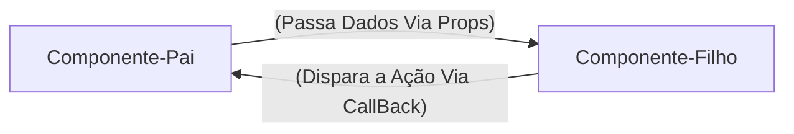
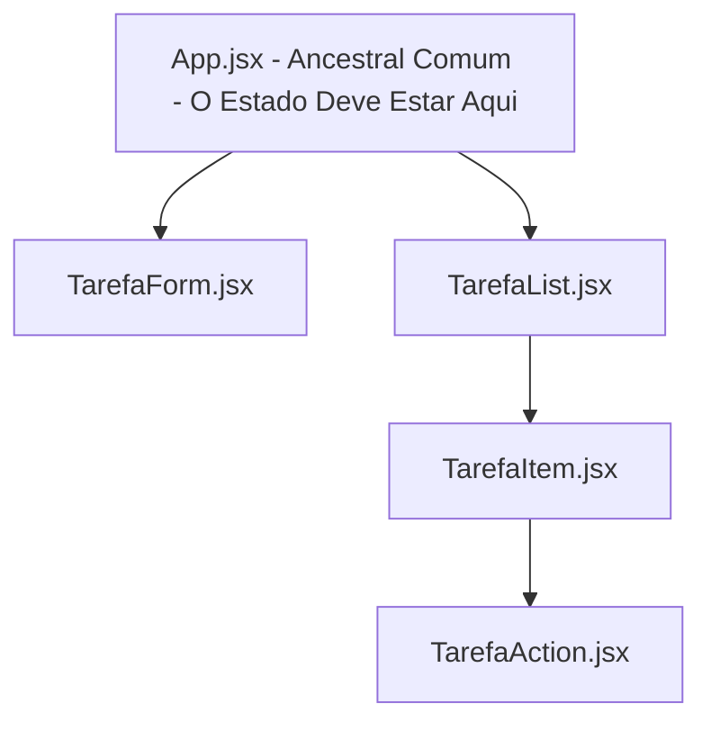

# REACT -Guia Rápido e Anotações

**Unidade Curricular:** Desenvolvimento FrontEnd
**Conteúdo:** Desenvolvimento de Frameworks - REACT

## Semana 1 - Introdução ao React e Ambiente de Desenvolvimento

### 1. O que é React?

- Uma biblioteca JavaScript para criação de interface de usuário (UI).
- Funciona de forma **declarativa**, você descreve o resultado esperado com base nos dados, eo React atualiza o navegador.
- Cria *SPAs* (Single Page Applications), atualizando partes da tela sem recarregar a página inteira.

### 2. React vs JavaScript Vanilla: SOM Tradicional vs Virtual DOM

O DOM no JavaScript tradicional é imperativo, procurando uma tag para mudar o componente e atualizar a página.

O React (Declarativo): UI é o componente (dados), quando os dados mudam, o React atualiza o componente.

### 3. Comandos Essenciais no Terminal

```bash

    #Criar projeto com o VITE (framework react)
    npm create vite@latest nome-projeto --template react

    #Atualizar e intalar dependências do node_modules
    npm install

    #Iniciar o servidor local (http://localhost:5173)
    npm run dev

```

```jsx

    //src/App.js
    //Componente raiz da Aplicação
    function App() {
        const sistema = "Meu Site";

        return (
            <main>
                <h1>{sistema}</h1>
                <p>Gerencie seus componentes em um só lugar!</p>
            </main>
        );
    }

    export default App;

```

> OBS: O JSX exibe **uma única tag raiz** (ou fragmento `<> ... </>`) e nomes de componentes sempre começam com a letra **Maiúscula** (UpperCamelCase).

---

## Semana 2 - JSX, Componetes, Props e Eventos 

### 1. Responsabilidade Única (SOLID)
- Quebrar a tela em componentes pequenos. Cada componente deve fazer uma única coisa bem feita:

**Exemplo de Componentes:**
- `Header`: Cuida do título e do cabeçalho da aplicação.
- `Footer`: Cuida do rodapé da aplicação.
- `NavBar`: Cuida da barra de navegação.

> OBS: O principio do Solid estabelece que uma unidade de software deve ter apenas um motivo para mudar.

### 2. Props: Passagem de Dados e Fluxo Unidiferecional

**O que são Props?**

Os Props são argumentos ou parâmetros das funções, sendo que um componete React é uma função JavaScript, ou seja, as Props (abreviação de properties) permitem que o componete pai envie dados dinâmicamente para o componete filho, tornando-o customizável e reutilizável.

### 3. Eventos e Comunicação via Callbacks

O Recat tem o encapsulamento de eventos nativos em objetos, e sua diferença para o HTML é a sintaxe.
- No HTML: `onclick="minhafuncao()"`
- No React JSX: `onClick={minhaFuncao}`

> OBS: Funções em JavaScript devem seguir o padrão LawerCamelCase de escrita.



### 4. Lista Dinâmicas com Map() e a Propriedades `Key`

**Porque Arrays São Estruturas Padrão do frontEnd?**

Os dados chegam de banco de dados e APIs no formato de coleção (Json), o método `.Map()` percorre cada item de uma array e retorna um novo componente JSX.

Exemplo:

```jsx
tarefas.map((tarefa) => (
    <TarefaItem
        key={tarefa.id}
        id={tarefa.id}
        titulo={tarefa.titulo}
        descricao={tarefa.descricao}
        completa={tarefa.completa}
    />
))

```

**Porque o react Exige `Key` no Uso do `.map()`**

O React quando renderiza uma lista precisa saber de forma inequívoca qual item específico foi adicionado, alterado ou removido. Se a chave for omitida, o react emite um aviso no console: `Warning: Each child in a list should have a unique "key" prop`.

> OBS: Evitar o índice do array como chave `(key={index})`, pois o índice do vetor não é fixo, use sempre uma chave única para os itens da lista (carimbo de data e hora, id único, etc).

### Componentes de Formulário Estático:

Criando o Arquivo `TarefaForm.jsx`

---

## Semana 3 - Estado Formulário e CRUD em Memória

**Tema:** Transição de uma interface estática para uma aplicação reativa, trabalha com o hook fundamental `useState`, construção de formulários com validação, CRUD completo com filtros e buscas textuais.

**Contextualização:** Na semana 2, houve a decomposição de tela monolírica em componentes reutilizáveis, organizando os fluxos de Props e captura de eventos.

### 1. O Conceito de Estado e o Hook `useState`

**Variável Comum vs Estado Reativo:**

```js

    //Variável comum do JS
    function Contador() {
        let contador = 0;

        function incremento() {
            contador += 1;
            console.log("Contador no Console:", contador); //Exibe o número
        }

        return (
            <div>
                <p>Clique: {contador}</p>
            </div>
        )
    }

```

> Observações: 
> * JavaScripts convencionais perdem suas variáveis locais ao termino da execução.
> * O React não monitora variáveis comuns. Ele não sabe que a variável mudou e , portanto, não tem motivo para redesenhar a tela.
> * O estado (state) é a memória do componente. Quando o estado é modificado por uma função, o React agenda uma nova execução da função do componente (re-renderizado), atualizando o virtual DOM e o navegador.

**A Sintexa do `useState`:** Ao invés do `let contador = 0;`. Usa-se:
```jsx

    const [contador, setContador] = useState(0);

```

> Observações:
> * `contador`: A foto do dado no momento da renderização atual.
> * `setContador`: A função despachante que atualiza o dado e notifica o React.
> * `useState(0)`: Define o valor com o qual o componete nasce.

**Chamando a Mudança de Estado:** O próximo valor sempre depende do valor anterior.

```jsx

    //Forma segura e profissional de realizar a mudança de estado
    setContador((prevContador) => prevContador + 1);
    // Atualização funcional do valor

    //Outra forma (profissional)
    setContador(contador + 1);
    
```

> OBS: Faz a mudança no aplicativo de lista de terefas
> React\lista-tarefas\src\App.jsx

### 2. - Elevação de Estado (Lifting State Up)

**A Comunicação Entre os Componentes:** Para que dois ou mais componentes no React compartilhem dados, o estado deve ser elevado para o enscestral comum entre eles.



> Observações:
> * O estado `tarefas` reside no App.jsx.
> * O App.jsx cria as funções de modificação (handleAddTarefa, handleMudarTarefa, handleDeletarTarefa).
> * Os dados descem como Props para quem precisa usa-los.
> * As funções descem como CallBacks para quem precisa disparar a ação.

### 3. Formulários Controlados e Validação

No HTML tradicional, os inputs guardam seu próprio texto internamente no DOM. No React, a única fonte de armazenamento deve ser o próprio React.

Um input é controlado quando:
1. Seu atributo `value` está amarrado a um estado do React.
2. Seu evento `onChange` atualiza esse mesmo estado a cada caracter digitado.

Exemplo de uso:
```jsx

const [titulo, setTitulo] = useState("")

<input

    type="text"
    value="titulo"
    onChange={(e) => setTitulo(e.target.value)}
/>

```

**Previnindo o Recarregamento com `event.preventDefault()`:** Evitar o comportamento nativo da web, que é submeter formulários ao re-recarregamento na página quando formulários ou eventos forem enviados.

```jsx
function handleSubmit(event) {
    event.preventDefault(); //Impede o carregamento da página
    // Processamento dos dados
}

```

**Construir Formulário na Atividade da Lista de Tarefas:** React\lista-tarefas\src\components\TarefaForm.jsx

### 4. Operações CRUD na Memória

**Imutabilidade no React:** Para que o React detecte uma alteração em um objeto ou array, devemos criar uma nova cópia com a alteração desejada. 
Métodos como `.push`, `.unshift`, `pop()`, não permitem modificar arrays no React, pois, o React compara o objeto na memória e identifica que não teve mudança e conclui que não precisa fazer a redenrização. A mudança só ocorre se for chamado o useState (mudança de estado).

**Operações de Imutabilidade no React:**

* **Inserir:** 

    `[novoItem, ...array]`
    <!-- A mudança  é feita criando um array com o novo item e espalhando os itens antigos -->

* **Remover:**

    `array.filter(item => item.id != id)`
    <!-- A mudança é feita criando um novo array filtrando os itens antigos e removendo o item desejado -->

* **Atualizar:**

    `array.map(item => item.id === id ? {...item, completed: true} : item)`
    <!-- A mudança é feita criando um novo array mapeando os itens antigos e atualizando o item desejado -->

**Adicionando as 4 operações do CRUD no App.jsx:** React\lista-tarefas\src\App.jsx

### 5. Filtros e Buscas

**Erro de Criação de Estados Duplicados:** Muitos programadores pensam em duplicar listas no React, porém, isso é um erro. Se você apaga uma tarefa em uma lista deve lembrar de apagar na outra também, se esquecer de fazer isso os dados ficam dessincronizados e podem gera problemas no código.

Para resolver esse problema, seu um dado pode ser calculado a partir de um estado já existente, esse calculo ou essa lógica. **Não crie um novo estado para ele, ou seja, não duplique!**.

**Vamos Criar um Componente Para Filtragem das Tarefas em Nossa Aplicação**
Digite o Camando no Teerminal 
